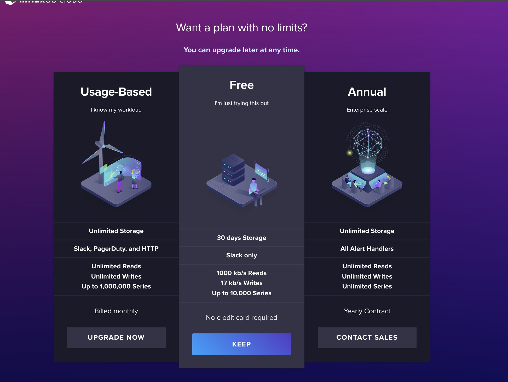
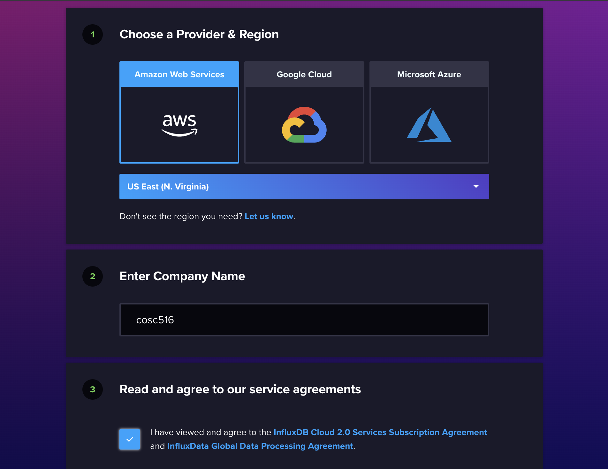
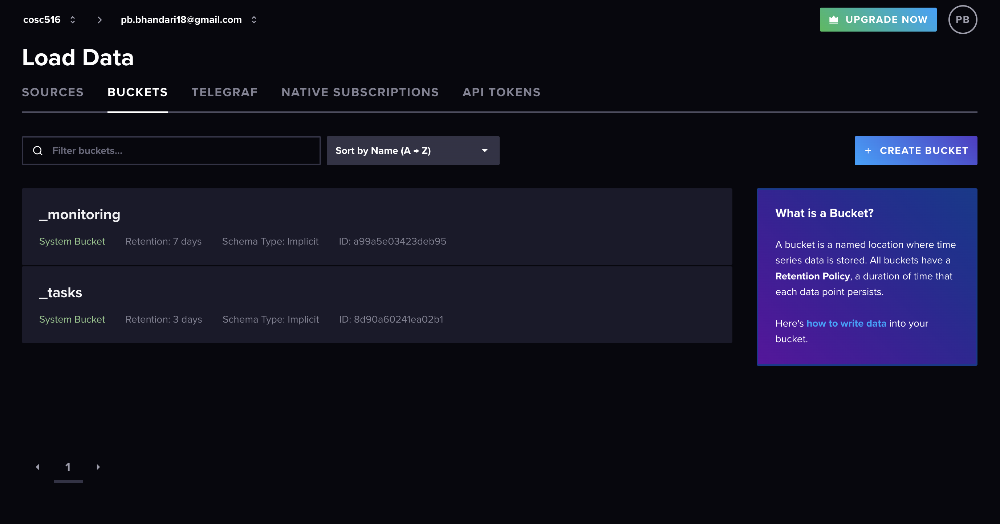
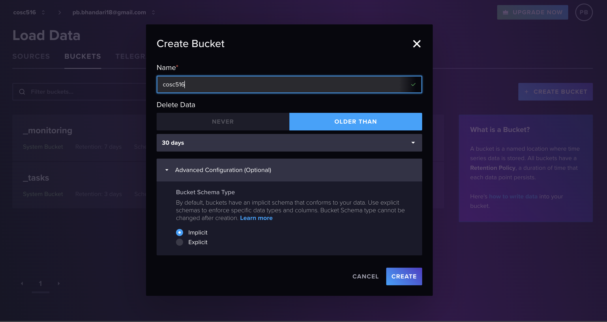

# Influx DB Lab
All new InfluxDB Cloud accounts start with Free Plan that provides a limited number of resources and data usage. This will be enough for this Lab. There is no need for payment information in this setup process. 

# Setup
Create a free account in influxdb cloud from https://cloud2.influxdata.com/signup

Choose the free tier.

Choose a provider. We chose AWS for our project.

Click on "Create Bucket" button.

Create a bucket as shown. 

This concludes the Setup on InfluxDB Cloud UI.

# Installing InfluxDB Client package in python
 You can visit https://us-east-1-1.aws.cloud2.influxdata.com/orgs/bdaf8d18e689480a/new-user-setup/python for step by step help in getting started. 

First you can use the following command line install statement to install the package as well:

<kbd>pip3 install influxdb-client</kbd>

After installing the dependencies you will have to export the <kbd>InfluxDB token</kbd> from the link given above

# References
https://docs.influxdata.com/influxdb/cloud/api-guide/client-libraries/python/

# Tasks

The file to edit is InfluxDB.py. The Test file is test.py. Marks for each method are below. You receive the marks if you pass all the Unit tests AND have followed the requirements asked in the question (including documentation and proper formatting).

+1 mark - Write the method <kbd>connect()</kbd> to make a connection to the database.

+1 mark - Method <kbd>drop()</kbd> to delete all data from the database.

+4 mark - Method <kbd>load()</kbd> to load all the data from the vix-daily.csv into the bucket with measurement name financial-analysis, tag="type" with value of "vix-daily" and fields = "open","high","low" and "close".

+3 mark - Method <kbd>query0()</kbd> to query the data of field "open" (VIX-Open), sort by value in ascending and limit by 5. 

+3 mark - Method <kbd>query1()</kbd> to query the maximum value of each field "high", "open", "close" and "low" from the whole data

+2 mark - Method <kbd>query2()</kbd> to query the data of field "high" (VIX-High) from Date 2006-12-26 to 2007-01-08, and sort by value in descending.

+3 mark - Method <kbd>query3()</kbd> to query the mean of "low" (VIX-Low) values per month starting from Date 2006-01-01 to 2006-12-31. Hint: use aggregateWindow()

+3 mark - Method <kbd>query4()</kbd> to query the total count of each field.

Total Marks: 20

# Bonus Marks: (up to 2)
Up to +2 bonus marks for demonstrating some other unique feature of InfluxDB.

# Submission
The lab is marked immediately by the professor by showing the output of the JUnit tests and by a quick code review. Otherwise, submit the URL of your GitHub repository on Canvas. Make sure to commit and push your updates to GitHub

